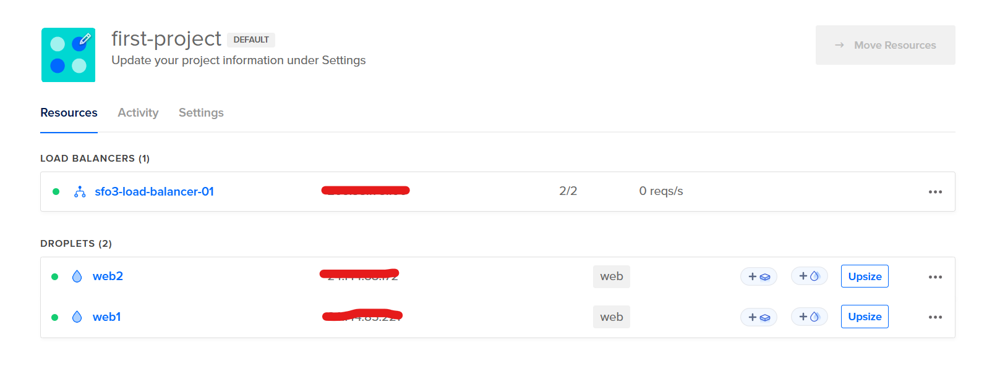
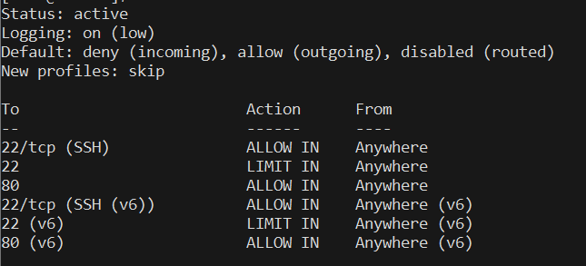
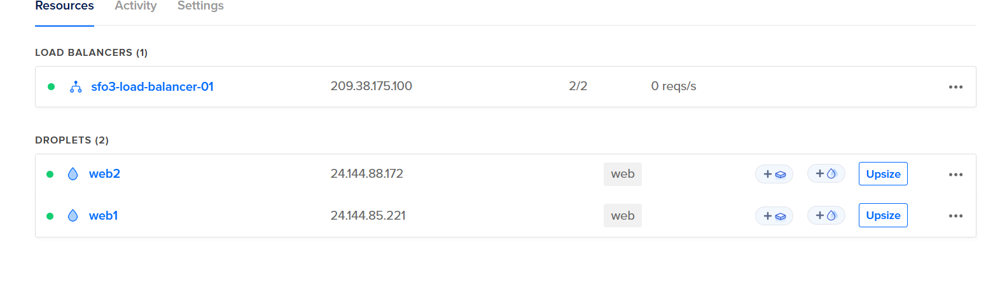
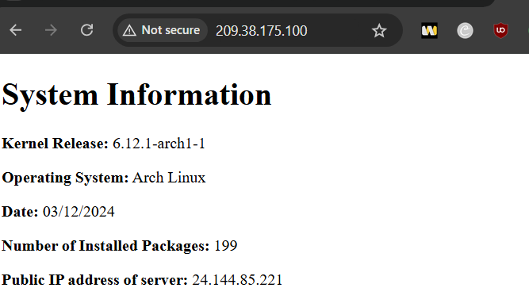
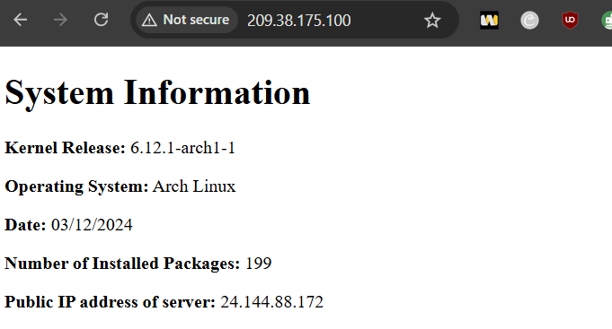
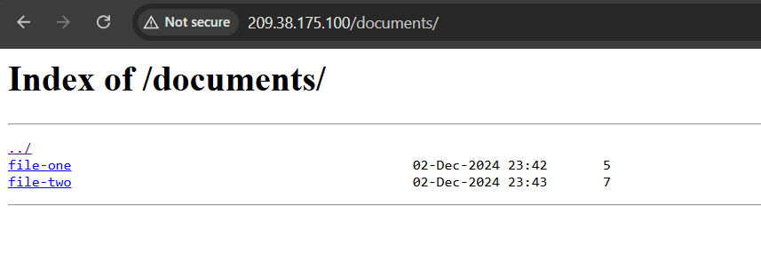
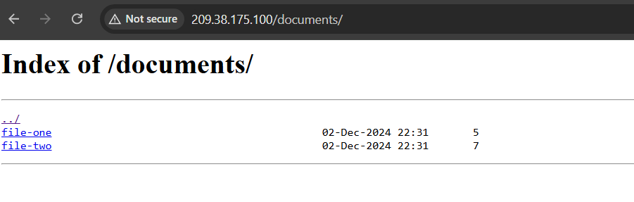

# Assignment 3 part 2


## Overview
These instructions will guide you to create two file server with a load balancer distributing traffic to them. along with a firewall on each droplet controlling which type of traffic is allowed while nginx runs the servers.


# Requirements:
in order to do this tutorial you would need to have two arch Linux droplets on Digital Ocean with a tag called `web` (the tag doesn't have to be specifically web you can name it anything you want)


# 1. Creating the load Balancer
To make the DigitalOcean droplet navigate to Digital Ocean.
1. get to the project where you see your two droplets.
2. you should see a big green button that says create at the top `Click it`
3. choose the load Balancer option.
4. choose the following options:
	1. Load Balancer type = Regional,
	2. datacenter region = San Francisco 3,
	3. Network Visibility = External (Public),
	4. leave Scaling configuration as default,
	5. Connect Droplet = the tag that connects your two droplets `web` ,
	6. choose any name you would like
	7. Click create load balancer
5. Now the load balancer will take a little while to complete so just wait patiently.

Once all these steps are completed you should see something like this:



# 2. `webgen` User and starter code

**NOTE:** everything being done from here on out should be done to both of your droplets. if there are nay exceptions i will point it out

`SSH` into your first droplet

```bash
ssh web1
```

Once you are at your `home directory` you need to clone the starter code provided in the command below

```bash
git clone https://git.sr.ht/~nathan_climbs/2420-as3-p2-start
```

once the repository has been successfully cloned to your home directory we can proceed to making the system user `webgen`

## `webgen` user:
we are creating a system user to be the owner of the file server for the following reasons:
1. security
2. assigned system resources
like the name suggests a `system-user`  are Linux users that are made for running system tasks and services. They also increase security as allocating something to a system user can indicate that other cant get to it, system users have no login shell and no password. This prevents user from being able to access them.

To create a system user run the following commands:

```bash
sudo useradd --system -s /usr/bin/nologin webgen
```

after running this command read the content of `/etc/passwd` to make sure that the user is created.

we have need to assign a home directory for our `webgen` user:

```bash
sudo usermod -d /var/lib/webgen -m webgen
```

we have now assigned the home directory `/var/lib/webgen` to our `webgen` user but that doesn't mean that the home directory actually exists.

we now need to make the home directory, we need a directory structure like this inside our `webgen` users home directory:

```bash
├── bin/ 
│    └── generate_index 
├── documents/ 
│    ├── file-one 
│    └── file-two 
└── HTML/ 
     └── index.html
```

to make the directory run:

```bash
sudo mkdir /var/lib/webgen
```

This will create the `webgen` directory. Inside the `webgen` directory make three directories named `bin`, `documents`, `HTML`.

Once these three directories are created make two regular files inside the `documents` directory. Add content to them which differentiates them from each other. 

```bash
sudo touch /var/lib/webgen/documents/file-one
```

run the command above twice but name the second file `file-two`.

Once these steps are completed we can now move the script inside the git repository we cloned into the `webgen` users `bin` directory.

## starter code


```bash
sudo mv ~/2420-as3-p2-start/generate_index /var/lib/webgen/bin/
```

once the script is moved to the bin directory, we can now either delete the other parts of the git repo or just keep it. That's completely up to you.

to remove the git remove simply run:

```bash
sudo rm -rf ~/2420-as3-p2-start
```

we need to give our script executable permissions so we can run:

```bash
sudo chmod u+x /var/lib/webgen/bin/generate_index
```

Once this step is complete, we now need to give ownership of `webgen`'s home directory to it:

```bash
sudo chown -R webgen:webgen /var/lib/webgen 
```

Once these steps have been completed you now have made a system user called `webgen` and assigned them their own home directory.

# 3. service and timer file

we need to make two new files, a service file which will run the script in `/var/lib/webgen/bin` and a timer file which will trigger the service file.

## service file
our service file will consist of two sections `[Unit]` and `[Service]` 

here is what it should look like 

```bash
[Unit]
Description=running the other file
Requires=network-online.target


[Service]
User=webgen
Group=webgen
ExecStart=/var/lib/webgen/bin/generate_index
```
The important parts of these scripts are:

1. Requires=network-online.target : which indicates that it should not run until the network-online target is active.
2. User and Group = webgen : indicates the user and group under which the service process should run
3. finally ExectStart : this part indicates the path to the place where we have our script

to check our script for errors we can run:

```bash
sudo systemd-analyze verify generate-index.service
```
if the result of this command is empty that means that your service file is good.

now we need to check for new unit files or changes to unit files by running:
```bash
sudo systemctl daemon-reload
```

this command should be ran when any changes have been made to unit files or changes made inside the directory `/etc/systemd/system`


we can now test if our service file actually works by starting it:

```bash
sudo systemctl start generate-index.service
```
once this command as been executed you want to check the directory `/var/lib/webgen/HTML` there should be a newly created `index.html` file in there.

## timer file
we now need to create the timer file which will trigger the service file to run everyday at 5

here is what the timer file will look like:
```bash
[Unit]
Description=running the service file

[Timer]
OnCalendar=*-*-* 05:00:00
Persistent=true

[Install]
WantedBy=timers.target
```
the important components of this timer file consist of:

1. OnCalendar=_-_-* 05:00:00 : which indicates that it should run everyday at 5 o clock
2. WantedBy=timers.target : timers.target sets up all timers that should be active after boot

just like the service file we need to make sure our timer file works and has no errors:

```bash
sudo systemd-analyze verify generate-index.timer
```

also remember to run:

```bash
sudo systemctl daemon-reload
```

to make the system aware of the changes made.

finally we can enable our timer so it start from boot and is starting right now also

```bash
sudo systemctl enable --now generate-index.timer
```

we can check the status of our unit files, its important to check the status of our unit files because it tells us the state of them and if they are working or not.

do check the status of our unit files run:
```bash
sudo systemctl status generate-index.<timer or service>
```

the very last thing we want to do is to move these two files in their respected directory.  we need to move these files into `/etc/systemd/system` this directory takes precedence over any other locations on the filesystem.

```bash
sudo mv ~/generate-index.* /etc/systemd/system
```

reminder `sudo systemctl daemon-reload`

# 4. `nginx` and `ufw`

we will be using `nginx` as our file server and `ufw` as our firewall.

before we do anything we need to install `nginx` and `ufw`:

```bash
sudo pacman -S nginx ufw
```

## nginx
the main configuration for nginx is at `/etc/nginx/nginx.conf`

we need to make nginx run under `webgen` and we also need to make a separate server block which will hold our file server

to make nginx run under webgen we can edit `/etc/nginx/nginx.conf`

```bash
sudo nvim /etc/nginx/nginx.conf
```

once in this file we need to uncomment the top line and add `webgen` there like so:

```bash
user webgen;
worker_processes  1;

#error_log  logs/error.log;
#error_log  logs/error.log  notice;
#error_log  logs/error.log  info;

#pid        logs/nginx.pid;
```

once this is changed you can save and quit.

it is better to use server blocks in separate directory instead of making changes inside our main nginx configuration file as its easier to trouble shoot, keeps it organized and easier to maintain.

I am going to be using the `sites-enabled` and `sites-available` approach.

we need to make two directories:

```bash
sudo mkdir /etc/nginx/sites-available
```

```bash
sudo mkdir /etc/nginx/sites-enabled
```

now we need to add our server block inside `sites-available`
```bash
sudo nvim /etc/nginx/sites-available/example.conf
```

the server block should look like this:
```bash
server {
	listen 80;
	listen [::]:80;

	server_name 159.223.194.99;

	root /var/lib/webgen/HTML;
	index index.html;

	location / {
	try_files $uri $uri/ =404;
	}

	location /documents {
        root /var/lib/webgen;
        autoindex on;                
        autoindex_exact_size off;    
        autoindex_localtime on;      
    }

}
```
save and quit

This is what the separate server block looks for this nginx server, The important components of this include:

1. listen 80 : which is the port
2. `listen [::]:80;` indicates ipv6 and the port for http which is 80
3. `root /var/lib/webgen/HTML;` the place being searched for the file specified in the next line `index index.html`
4. `location /` what happens when the user requests the project root
5. the rest is just error checking
6. `location /documents` : this part will be appended to the path at root and this will be the full path that gets searched for the files for example the full path here would be `/var/lib/webgen/documents`
7. `autoindex` enables directory listing
8. `autoindex_exact_size` is for human readable file sizes
9. `autoindex_localtime` is for showing file timestamps


now that we have created our server block we need to go back to the original nginx configuration file and append it in there.

```bash
sudo nvim /etc/nginx/nginx.conf
```

go to the http block and append include sites-enabled/*; to it

```bash
http {
    include       mime.types;
    include sites-enabled/*;
```

once this is done save and quit and we can enable the site by creating the symbolic link 

```bash
sudo ln -s /etc/nginx/sites-available/example.conf /etc/nginx/sites-enabled/example.conf
```

to test the configuration of our nginx file and to check the files referenced inside it we can run:

```bash
sudo nginx -t
```

if instructions were followed properly you should see something like this:

```bash
nginx: the configuration file /etc/nginx/nginx.conf syntax is ok
nginx: configuration file /etc/nginx/nginx.conf test is successful
```

## ufw
now we are going to configure and set up the `ufw` firewall we need to allow ssh connections, http connections, and set a connection limit

`ufw` consists of two part, the service and the firewall itself. Its important to know the difference because if you start the firewall without letting in ssh connections your gonna lose access to your droplet

we want to set the firewall service to start from boot and to start right now we can do that with the command:

```bash
sudo systemctl enable --now ufw.service
```

to check the status of your firewall you can run:

```bash
sudo ufw status verbose
```

now once our firewall service has been enabled we can allow in certain connections:

```bash
sudo ufw allow SSH
```

```bash
sudo ufw allow http
```

```bash
sudo ufw limit ssh
```

Once all of these are executed we can now start the firewall itself.

```bash
sudo ufw enable
```

this should enable the firewall and we can check the status now by running the command previously mentioned:

```bash
sudo ufw status verbose
```

we should see something like this:


congrats your nginx server and firewall should be up and running

# 5.  wrap up

once all of these steps have been completed, then we can make our way to the browser and check if everything is working

lets check that the load balancer works:

now that we know the IP addresses of the everything lets type the ip address of the load balancer into the browser



The load balancer puts us into this server now lets refresh and it should take us into the other one



as you can see it takes us to both the server now lets check the `/documents`, you would need to refresh just like this one so we get redirected.

pay attention to the date edited





as you can see everything works properly.

# 😁😁

# References:
https://www.digitalocean.com/community/tutorials/understanding-nginx-server-and-location-block-selection-algorithms
https://www.digitalocean.com/community/tutorials/understanding-systemd-units-and-unit-files
https://wiki.archlinux.org/title/Systemd/Timers
https://man.archlinux.org/man/systemd-analyze.1